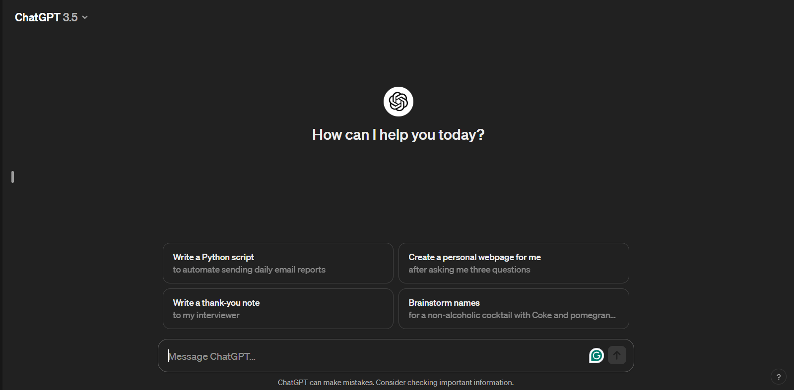

# CodeGenClash

## Setup the project
`./gradlew build`
### SonarQube
1. Set up SonarQube locally from docker file. Follow the [instructions on the page](https://docs.sonarsource.com/sonarqube/latest/try-out-sonarqube/)
2. When you boot it up create a local project.
3. In you will find sonar properties to adjust. Please follow [this tutorial](https://github.com/IBM/sonarqube/blob/master/docs/get-started-with-sonarqube/README.md). I myself had problems with setting up those parameter with commandline thus all are set as properties. Which in case of a token is horribly incorrect but we gotta manage somehow ;).
```
sonar {
    properties {
        property("sonar.projectKey", "CodeGenClash")
        property("sonar.projectName", "CodeGenClash")
        property("sonar.host.url", "http://localhost:9000")
        property("sonar.token", "sqp_e6bf59e7883e1c88770dc548087caa42a0a96375")
    }
}
```
4. In order tu run the sonar analysis run `./gradlew sonar` command

### Checkstyle
Please follow [this tutorial](https://github.com/Wladska/HalsteadMetricsCalc/blob/main/README.md).

## Github Copilot


To install the GitHub Copilot Chat extension in Visual Studio
1. Open Visual Studio.
2. On the menu bar, select Extensions > Manage Extensions.
3. In the Search box, enter "GitHub Copilot Chat".
4. Select the GitHub Copilot Chat extension, and then select the Download button.
5. Restart Visual Studio to complete the installation process. [1]

After this you will be able to use a 30 day trial period.


[Install GitHub Copilot Chat in Visual Studio](https://learn.microsoft.com/en-us/visualstudio/ide/visual-studio-github-copilot-chat?view=vs-2022)


## Amazon CodeWhisperer


To install the CodeWhisperer extension in Visual Studio:
1. Open Visual Studio.
2. On the menu bar, select Extensions > Manage Extensions.
3. In the Search box, enter "AWS Toolkit"
4. Select the AWS Toolkit extension, and then select the Download button.
5. Pick the free CodeWhisperer version
5. Create free account

You are ready to go. [2]


## Tabnine


1. Under Extensions, choose Manage Extensions
2. In the extensions window, search "Tabnine" and click Download
3. In your Visual Studio 2022 IDE, go to Extensions >> Tabnine and open Tabnine Hub.
4. Sign in to Tabnine by clicking the Sign in link on the top right corner of the Tabnine Hub.
5. After you sign in successfully, you will see 'Tabnine: authenticated' in your status bar [3]


## ChatGPT 3.5
1. Goto https://chat.openai.com/auth/login
2. Create an account
3. Start using the chat



## Meta Code Llama
https://huggingface.co/spaces/codellama/codellama-13b-chat
https://www.llama2.ai/

### Bibliography
[1] https://learn.microsoft.com/en-us/visualstudio/ide/visual-studio-github-copilot-chat?view=vs-2022

[2] https://www.youtube.com/watch?v=rHNMfOK8pWI&ab_channel=AmazonWebServices

[3] https://support.tabnine.com/hc/en-us/articles/4413894134161-Install-Tabnine-on-Visual-Studio-2022